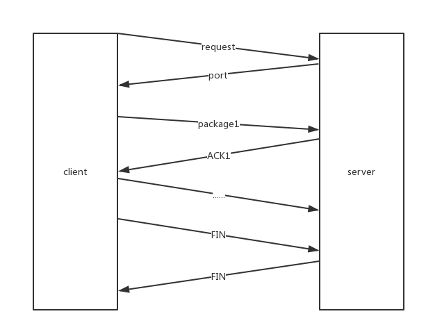
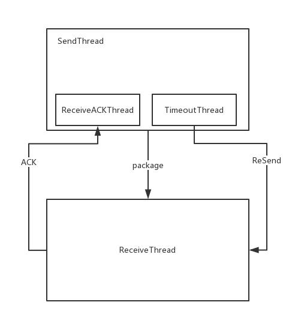
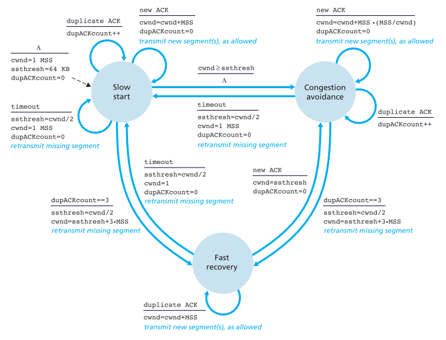
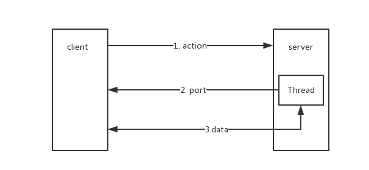

# LFTP设计文档

本设计文档为`计算机网络期中项目——LFTP`的设计文档，LFTP使用UDP作为传输层协议，在应用层实现TCP的以下几个特性：

* 100%安全可靠的数据连接
* TCP流控制
* TCP拥塞控制
* 支持多用户

[源代码传送门](https://github.com/CookiesChen/LFTP)

## 实验环境

* OS：`Windows 10`
* language: `Java`，`jdk 1.8`

## 设计说明

### 使用

命令行使用`picocli`实现

客户端支持命令参数

```
-a --action //客户端动作,lsend或者lget
-i --ip     //服务器ip
-f --file   //需要传送的文件名
```

jar包运行

```powershell
// 客户端
java -jar client.jar -a lsend -f filname
java -jar client.jar -a lget -f filename
// 服务器
java -jar server.jar
```

ps：服务器固定监听9090端口，请保证该端口不被占用

### 文件结构

 ```
|--client
|	|--Main.java
|--server
|	|--Main.java
|--service
|	|--TCPPackage.java
	|--NetSocket.java
	|--SendThread.java
	|--ReceiveThread.java
	|--FileIO.java
 ```

最终生成两种`jar`包，客户端和服务器端。

`TCPPackage`：封装本次发送的数据包。

`NetSocket`：用于操作端口。

`FileIO`：用于文件的读写，大文件处理分块。

`SendThread`：发送线程，用于发送数据，内含`ReceiveACKThread`，接受接收线程返回的ACK包；以及`TimeoutThread`用于超时重传。

`ReceiveThread`：接收线程，用于接收数据并且返回ACK包。

### 数据包设计

参考TCP报文的实现，数据包由以下几部分：

* `ACK`(int)：确认号
* `FIN`(boolean)：结束标志位
* `seq`(int)：序列号
* `action`(boolean)：客户端动作，true为发送文件，false为接收文件
* `data`：数据

```java
public class TCPPackage implements Serializable {
    private int ACK; 	 	// 确认号
    private boolean FIN; 	// FIN标志位
    private int seq;     	// 序列号
    private boolean action; // 客户端动作
    private byte[] data; 	// 数据包
}
```

### 可靠安全连接

 **连接建立过程：**

* 服务器监听端口（9090）。
* 客户端发送请求连接报文，包含客户端动作(GET or SEND)。
* 服务器接受请求报文，并且返回一个`可用端口`给客户端。
* 根据客户端动作进行以下操作：
  * SEND：客户端开启发送线程，服务器开启接受线程。
  * GET：客户端开启接受线程，服务器开启发送线程。
* 发送线程发送FIN报文，并且等待特定时间后关闭线程。
* 接收线程接受FIN报文，并且等待特定时间后关闭线程。



**GBN实现**：

维护一个窗口，

* `SendThread`：发送线程,维护`base`和`nextseqnum`，每次发送一个包`nextseqnum++`。
  * `ReceiveACKThread`：接受ACK包线程，每次更新`base=ACK+1`，表示当前已发送但未确认的序号。
  * `TimeoutThread`：超时线程，每次超时重传`base`到`nextseqnum`之间的包。
* `ReceiveThread`：接收线程，维护`expectednum`，表示当前接收方希望收到的包的序号。



### 流控制

接收线程`ReceiveThread`：

* 维护一个`buffer`，当`buffer`填满时，将buffer中的数据写到文件中。
* 接收到一个数据包就返回当前的`rwnd`。

发送线程`SendThread`：

* 接收到rwnd如果小于0，发送seq为-1的特殊报文包，不停向接收线程询问rwnd。

### 拥塞控制

* 慢启动状态：
  * cwnd递增，如果接收的是冗余ACK包，`duplickACK`增加，否则更新`lastACK`
  * 如果超过阈值`ssthresh` ，则进入拥塞避免状态。
  * 冗余ACK包数量等于3时，进入拥塞避免状态。
* 拥塞避免状态：
  * 如果接收的是冗余ACK包，`duplickACK`增加， 否则`cwnd = 1 / cwnd`。
* 快速重传状态：
  * 如果接收的是冗余ACK包，`cwnd`增加，否则进入拥塞避免状态。
* 超时：
  * 超时之后，阈值`ssthresh = cwnd/2`，`cwnd = 1`，并且进入慢启动状态。



### 多用户

客户端进程访问服务器，服务器为每一个用户开启一个线程处理请求。



### 大文件处理

数据分块，每次读取10MB的数据，并且需要等待发送线程把数据发送完成，再取下一块数据，使用Java的`FileInputStream`和`FileOutputStream`，使用`skip`跳过特定的字节数，因为skip设计的缺陷，跳过的字节数大概只能支持2GB，超过这个范围，就会反馈文件头试图移动到开头的异常，因此需要分开几次进行跳过。

