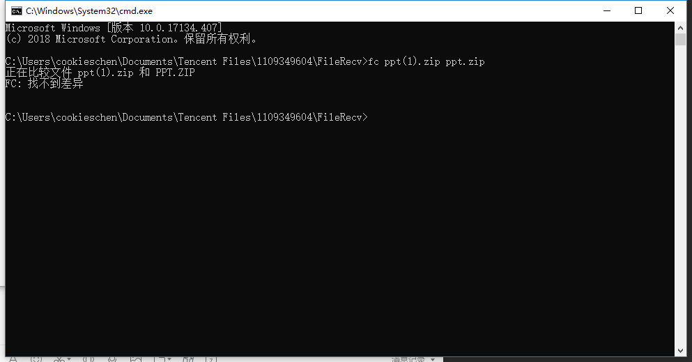

# LFTP-Test Doc

LFTP测试文档

## 局域网测试

#### 接收文件

接收一个`1.avi`，文件大小`95.9 MB`

```powershell
$ java -jar -a lget -i localhost -f 1.avi 
```

**服务器端：**


**客户端：**


局域网内丢包的情况基本不存在，可以看到速度可以达到9MB/s，只用了11s就传输完成了。

比对一下md5哈希


文件哈希一样，说明文件成功传输。

#### 发送文件

发送一个小文件`test.zip`

```powershell
$ java -jar -a lsend -i localhost -f test.zip
```

**服务器端：**


**客户端：**


## 跨互联网测试

**测试环境：**

* 服务器1：
  * ip：139.199.7.143
  * 带宽：1M
* 服务器2：
  * ip：134.175.21.212
  * 带宽：1M

**并行获取：**


将服务器的文件拉取到本地后用FC进行校验



## 大文件传输

选择一个文件在局域网中进行传输

选择marvels.mkv，大小`1.79GB`

**服务器端**


**客户端**


**内存损耗**


**文件对比**


md5哈希值一致，大文件传输测试成功，因为文件分块，读入内存中的数据不会过度使用堆内存，不然会出现OOM