# LFTP-Test Doc

LFTP测试文档

## 局域网测试

#### 接收文件

接收一个`1.avi`，文件大小`95.9 MB`

```powershell
$ java -jar -a lget -i localhost -f 1.avi 
```

**服务器端：**

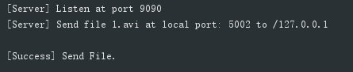

**客户端：**

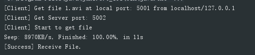

局域网内丢包的情况基本不存在，可以看到速度可以达到9MB/s，只用了11s就传输完成了。

比对一下md5哈希

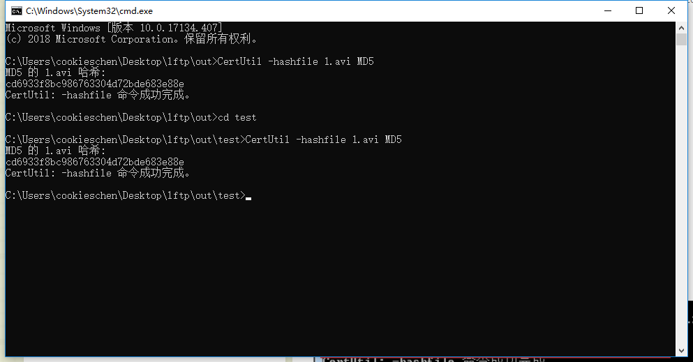

文件md5哈希一致，说明接收文件成功。

#### 发送文件

发送一个小文件`test.zip`

```powershell
$ java -jar -a lsend -i localhost -f test.zip
```

**服务器端：**

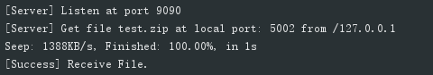

**客户端：**

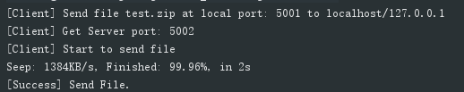

比对一下md5哈希

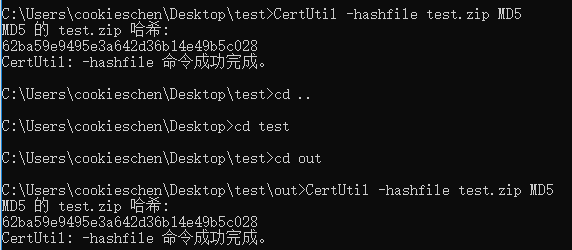

文件md5哈希一致，说明文件成功传输。

## 跨互联网测试

**测试环境：**

* 服务器1：
  * ip：139.199.7.143
  * 带宽：1M
* 服务器2：
  * ip：134.175.21.212
  * 带宽：1M

**下载文件**

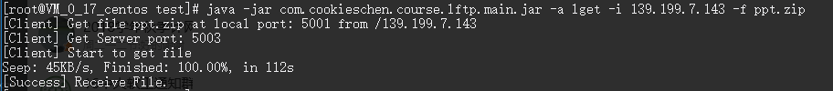

传输ppt.zip，哈希在并行获取时一并检测。

**并行获取：**

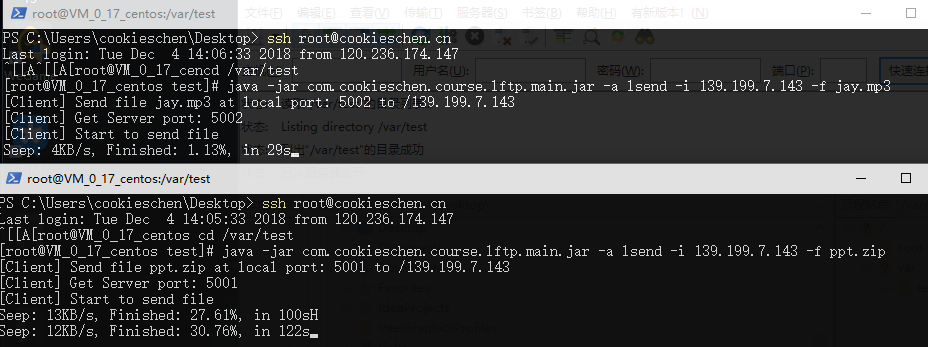

将服务器的文件拉取到本地后用FC进行校验

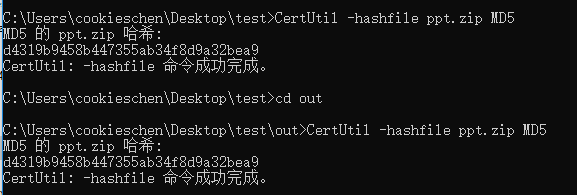

没有找到差异，说明文件成功在互联网下传输。

## 大文件传输

选择一个文件在局域网中进行传输

选择marvels.mkv，大小`1.79GB`

**服务器端**

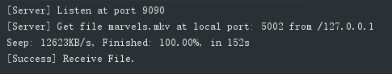

**客户端**

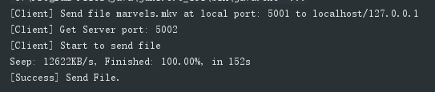

**内存损耗**


**文件对比**

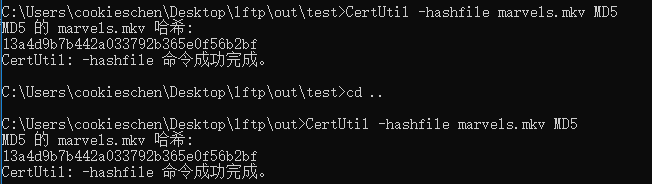

md5哈希值一致，大文件传输测试成功，因为文件分块，读入内存中的数据不会过度使用堆内存，不然会出现OOM，内存占用也不会太大。

##拥塞控制测试

因为在两台服务器上速率过低，无法查看区别，因此在局域网中测试

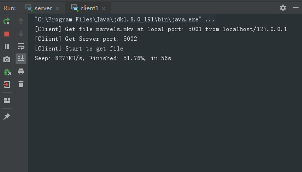

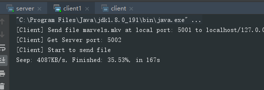

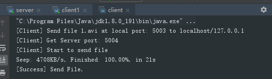

可以看到，`client1`的传输速度大概为8M，当`client`参与传输之后，带宽逐渐被`client1`和`client`均分，因为拥塞控制是加性增乘性减，因此两者带宽会趋近于相等，从图中就可以明显看出。